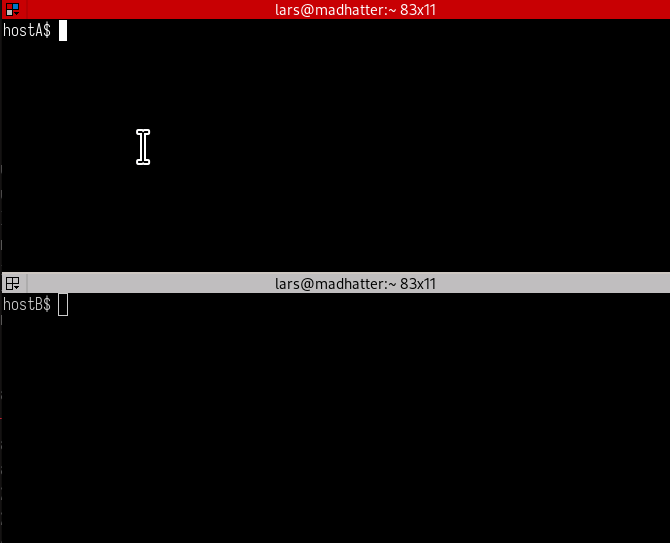

This is a trivial bit of code that communicates with an AGWPE service such as [Direwolf] and lets you (a) attach a Unix command to an ax.25 listener using `agwlisten` and (b) connect to such a listener using `agwconnect`.

[direwolf]: https://github.com/wb2osz/direwolf

This is a bit like `ax25d` and `axcall`, but these tools don't rely on the kernel AX.25 stack.

## Building the code

To build the code:

```
make
```

This will produce two commands, `agwconnect` and `agwlisten`.

## Usage

### agwlisten

```
Usage: ./agwlisten [options] command [arg [...]]

Options:
  -callsign string
    	Your callsign
  -escape string
    	Escape character (default "~")
  -tncaddress string
    	AGW TNC Address (default "127.0.0.1:8001")
```

### agwconnect

```
Usage: ./agwconnect [options] target_callsign

Options:
  -callsign string
    	Your callsign
  -tncaddress string
    	AGW TNC Address (default "127.0.0.1:8001")
```

## Examples

Start a listener that will run a bash shell:

```
agwlisten --callsign N1LKS-1 /bin/bash
```

Connect to the shell:

```
agwconnect --callsign N1LKS-2 N1LKS-1
```



## Why?

Having the kernel AX.25 stack lock up my computer gets old fast. I just wanted a way to establishing an interactive connection between two devices over an AX.25 radio link. Direwolf provides a perfectly good AX.25 stack, but there are few tools under Linux that can take advantage of that.
